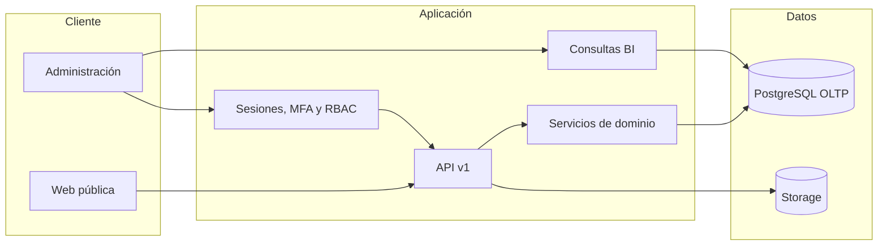

# Arquitectura

CasaViva es deliberadamente un monolito modular. Next.js mantiene la experiencia pública y administrativa; Django concentra autorización y reglas de negocio; PostgreSQL es la única base operacional inicial. No se implementan microservicios, Kafka, Airflow, Redis obligatorio, Celery, Data Lake, Data Warehouse físico ni IA.

| Módulo | Responsabilidad |
| --- | --- |
| `accounts` | Usuario por correo, MFA, recuperación, sesiones y roles. |
| `geo` | Estados, municipios, localidades y colonias. |
| `catalog` | Desarrolladoras, desarrollos, modelos M:N, offerings, amenidades y características. |
| `listings` | Publicación, slugs, precio y disponibilidad históricos. |
| `media_library` | Metadata, validación y almacenamiento seguro. |
| `crm` | Leads, consultas, intereses, visitas, ventas y consentimientos. |
| `analytics` | Visitantes, sesiones, eventos y consultas BI. |
| `marketing` | Campañas y gasto manual. |
| `audit` | Registro inmutable de acciones. |
| `content` | Home y guías editables. |
| `common` | IDs, archivo lógico, request ID, errores y servicios compartidos. |

`HousingModel` expresa identidad comercial; `DevelopmentModel` la relación M:N; `PropertyOffering` la configuración vendible. Precio, disponibilidad y etapa de lead son historiales. Publicar, archivar y eliminar son transiciones diferentes. `NULL` significa desconocido y la interfaz omite esa métrica. Los agregados BI están detrás de contratos estables para migrarlos a marts sin cambiar el frontend.
