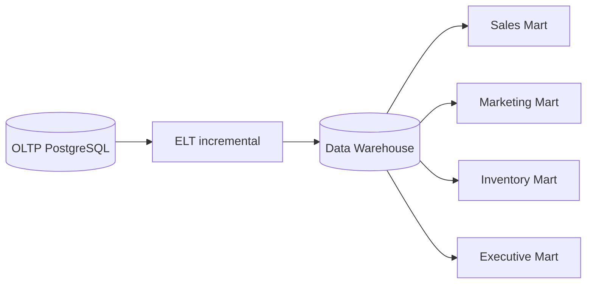

# Roadmap de Data Warehouse

> **NO IMPLEMENTADO AÚN.** Documenta el camino futuro, no infraestructura activa.

Dimensiones: `dim_date`, `dim_time`, `dim_developer`, `dim_development`, `dim_model`, `dim_offering`, `dim_location`, `dim_channel`, `dim_campaign`, `dim_lead`, `dim_admin_user`.

Hechos: `fact_web_event`, `fact_search`, `fact_inquiry`, `fact_lead_stage`, `fact_visit`, `fact_sale`, `fact_price_snapshot`, `fact_inventory_snapshot`, `fact_ad_spend`.

Los UUID operacionales se conservarán como claves de origen. La extracción será incremental por `updated_at`/`occurred_at` y reconciliará conteos y montos antes de publicar cada lote.
