# Diagrama entidad–relación

El diagrama representa las entidades empresariales de todas las migraciones vigentes. Las tablas internas de Django (`auth_group`, permisos, sesiones, content types y `otp_totp_totpdevice`) se señalan por su relación funcional, pero sus columnas pertenecen al framework.

```mermaid
erDiagram
  USER {
    uuid id PK
    string email UK
    string first_name
    string last_name
    boolean is_active
    boolean is_staff
    boolean is_superuser
    integer authz_version
    datetime last_password_change_at
    datetime created_at
    datetime updated_at
  }
  RECOVERY_CODE { uuid id PK uuid user_id FK string code_hash datetime used_at datetime created_at }
  PERMISSION_OVERRIDE { uuid id PK uuid user_id FK integer permission_id FK string effect uuid created_by_id FK }
  STATE { uuid id PK string name UK string code UK boolean is_active }
  MUNICIPALITY { uuid id PK uuid state_id FK string name boolean is_active boolean is_featured }
  LOCALITY { uuid id PK uuid municipality_id FK string name boolean is_active }
  NEIGHBORHOOD { uuid id PK uuid municipality_id FK uuid locality_id FK string name string postal_code boolean is_active }
  MEDIA_ASSET { uuid id PK string storage_key UK string media_type string mime_type bigint byte_size integer width integer height string sha256 string alt_text uuid uploaded_by_id FK }
  SOURCE_RECORD { uuid id PK string source_type string source_name string source_url datetime observed_at text notes uuid created_by_id FK }
  DEVELOPER { uuid id PK string name string legal_name string slug UK string website uuid logo_media_id FK boolean is_active integer version datetime archived_at }
  DEVELOPMENT { uuid id PK uuid developer_id FK string name string slug UK uuid state_id FK uuid municipality_id FK uuid locality_id FK uuid neighborhood_id FK decimal latitude decimal longitude boolean is_active boolean is_published boolean is_featured integer version datetime archived_at }
  HOUSING_MODEL { uuid id PK uuid developer_id FK string name string internal_code string slug UK text base_description boolean is_active integer version datetime archived_at }
  DEVELOPMENT_MODEL { uuid id PK uuid development_id FK uuid housing_model_id FK string display_name_override boolean is_active integer version datetime archived_at }
  PROPERTY_TYPE { uuid id PK string code UK string name boolean is_active integer sort_order }
  PROPERTY_OFFERING { uuid id PK string source_type string condition uuid development_model_id FK string variant_name uuid property_type_id FK uuid state_id FK uuid municipality_id FK uuid locality_id FK uuid neighborhood_id FK string street_address string postal_code decimal latitude decimal longitude decimal bedrooms_min decimal bedrooms_max decimal bathrooms_total integer full_bathrooms integer half_bathrooms integer parking_min integer parking_max integer levels_min integer levels_max decimal construction_area_min decimal construction_area_max string construction_area_basis decimal land_area_min decimal land_area_max string land_area_basis decimal garden_area_min decimal garden_area_max string garden_area_basis decimal default_commission_rate integer version datetime archived_at }
  AMENITY { uuid id PK string name string slug UK string category boolean is_active integer sort_order }
  DEVELOPMENT_AMENITY { bigint id PK uuid development_id FK uuid amenity_id FK }
  OFFERING_AMENITY { bigint id PK uuid offering_id FK uuid amenity_id FK }
  FEATURE_DEFINITION { uuid id PK string code UK string label string category string data_type string unit boolean is_public boolean is_filterable boolean is_active integer sort_order }
  FEATURE_CHOICE { uuid id PK uuid definition_id FK string value string label integer sort_order }
  OFFERING_FEATURE_VALUE { uuid id PK uuid offering_id FK uuid definition_id FK boolean value_boolean decimal value_number text value_text uuid value_choice_id FK }
  DEVELOPMENT_MEDIA { bigint id PK uuid development_id FK uuid media_id FK string role integer sort_order }
  OFFERING_MEDIA { bigint id PK uuid offering_id FK uuid media_id FK string role integer sort_order }
  PRICE_RECORD { uuid id PK uuid offering_id FK string price_type decimal amount_min decimal amount_max string currency datetime effective_from datetime effective_to uuid source_record_id FK uuid created_by_id FK }
  AVAILABILITY_RECORD { uuid id PK uuid offering_id FK string status datetime effective_from datetime effective_to uuid changed_by_id FK text notes }
  LISTING { uuid id PK uuid offering_id FK string title string slug UK boolean is_published boolean is_featured datetime published_at datetime unpublished_at integer version datetime archived_at }
  LISTING_MEDIA { bigint id PK uuid listing_id FK uuid media_id FK string role integer sort_order }
  SLUG_REDIRECT { uuid id PK string old_path UK string new_path datetime created_at }
  LEAD { uuid id PK string first_name string last_name string email string phone_raw string phone_normalized string status uuid owner_user_id FK string first_source string last_source integer version datetime archived_at }
  LEAD_STAGE_HISTORY { uuid id PK uuid lead_id FK string stage datetime started_at datetime ended_at uuid changed_by_id FK }
  INQUIRY { uuid id PK uuid lead_id FK uuid listing_id FK string channel string intent string subject text message uuid session_id string status uuid assigned_to_id FK }
  LEAD_INTEREST { uuid id PK uuid lead_id FK uuid offering_id FK string interest_type datetime created_at }
  VISIT { uuid id PK uuid lead_id FK uuid offering_id FK datetime scheduled_at string status datetime completed_at uuid assigned_to_id FK text notes }
  SALE { uuid id PK uuid lead_id FK uuid offering_id FK uuid listing_id FK decimal sale_price decimal commission_rate decimal commission_amount datetime closed_at string status uuid created_by_id FK }
  PRIVACY_NOTICE_VERSION { uuid id PK string version UK datetime published_at string content_hash boolean is_active }
  CONSENT_RECORD { uuid id PK uuid lead_id FK uuid visitor_id uuid privacy_notice_version_id FK string purpose boolean granted datetime granted_at string source }
  ANONYMOUS_VISITOR { uuid id PK datetime first_seen_at datetime last_seen_at }
  WEB_SESSION { uuid id PK uuid visitor_id FK uuid lead_id FK datetime started_at datetime last_seen_at string utm_source string utm_medium string utm_campaign string landing_path string consent_state }
  ANALYTICS_EVENT { uuid id PK datetime occurred_at datetime received_at string event_name integer schema_version uuid visitor_id FK uuid session_id FK uuid lead_id FK uuid listing_id FK uuid offering_id FK uuid development_id FK json properties uuid listing_public_key string listing_title_snapshot }
  MARKETING_CAMPAIGN { uuid id PK string name string utm_campaign UK string channel date start_date date end_date boolean is_active integer version datetime archived_at }
  MARKETING_SPEND { uuid id PK uuid campaign_id FK date date decimal amount string currency boolean is_voided datetime voided_at uuid voided_by_id FK string void_reason }
  HOME_CONTENT { uuid id PK string key UK string hero_title string editorial_title text editorial_body uuid editorial_media_id FK integer version datetime archived_at }
  HOME_HERO_SLIDE { uuid id PK uuid home_content_id FK uuid listing_id FK string eyebrow_override string title_override string subtitle_override integer sort_order boolean is_active integer version datetime archived_at }
  SITE_SETTINGS { uuid id PK string key UK string contact_email string facebook_url string instagram_url string tiktok_url integer version datetime archived_at }
  GUIDE { uuid id PK string slug UK string title text excerpt text content string category uuid hero_media_id FK boolean is_published boolean is_featured datetime published_at integer version datetime archived_at }
  LOCATION_CONTENT { uuid id PK uuid municipality_id FK string slug UK text description uuid hero_media_id FK boolean is_featured decimal latitude decimal longitude integer version datetime archived_at }
  AUDIT_EVENT { uuid id PK datetime occurred_at uuid actor_user_id FK string action string entity_type string entity_id json old_values json new_values string request_id string ip_hash boolean success text reason }

  USER ||--o{ RECOVERY_CODE : posee
  USER ||--o{ PERMISSION_OVERRIDE : personaliza
  STATE ||--o{ MUNICIPALITY : contiene
  MUNICIPALITY ||--o{ LOCALITY : contiene
  MUNICIPALITY ||--o{ NEIGHBORHOOD : contiene
  LOCALITY o|--o{ NEIGHBORHOOD : agrupa
  DEVELOPER ||--o{ DEVELOPMENT : crea
  DEVELOPER ||--o{ HOUSING_MODEL : define
  DEVELOPMENT ||--o{ DEVELOPMENT_MODEL : relaciona
  HOUSING_MODEL ||--o{ DEVELOPMENT_MODEL : relaciona
  DEVELOPMENT_MODEL o|--o{ PROPERTY_OFFERING : configura
  PROPERTY_TYPE ||--o{ PROPERTY_OFFERING : clasifica
  DEVELOPMENT ||--o{ DEVELOPMENT_AMENITY : tiene
  AMENITY ||--o{ DEVELOPMENT_AMENITY : cataloga
  PROPERTY_OFFERING ||--o{ OFFERING_AMENITY : tiene
  AMENITY ||--o{ OFFERING_AMENITY : cataloga
  FEATURE_DEFINITION ||--o{ FEATURE_CHOICE : ofrece
  PROPERTY_OFFERING ||--o{ OFFERING_FEATURE_VALUE : valora
  FEATURE_DEFINITION ||--o{ OFFERING_FEATURE_VALUE : define
  MEDIA_ASSET ||--o{ DEVELOPMENT_MEDIA : enlaza
  MEDIA_ASSET ||--o{ OFFERING_MEDIA : enlaza
  MEDIA_ASSET ||--o{ LISTING_MEDIA : enlaza
  HOME_CONTENT ||--o{ HOME_HERO_SLIDE : ordena
  LISTING ||--o{ HOME_HERO_SLIDE : presenta
  PROPERTY_OFFERING ||--o{ PRICE_RECORD : historiza
  PROPERTY_OFFERING ||--o{ AVAILABILITY_RECORD : historiza
  PROPERTY_OFFERING ||--o| LISTING : publica
  LISTING ||--o{ LISTING_MEDIA : presenta
  LEAD ||--o{ LEAD_STAGE_HISTORY : recorre
  LEAD ||--o{ INQUIRY : genera
  LISTING o|--o{ INQUIRY : origina
  LEAD ||--o{ LEAD_INTEREST : expresa
  PROPERTY_OFFERING ||--o{ LEAD_INTEREST : recibe
  LEAD ||--o{ VISIT : agenda
  PROPERTY_OFFERING ||--o{ VISIT : recibe
  LEAD ||--o{ SALE : cierra
  PROPERTY_OFFERING ||--o{ SALE : protege
  LISTING o|--o{ SALE : referencia
  PRIVACY_NOTICE_VERSION ||--o{ CONSENT_RECORD : respalda
  LEAD o|--o{ CONSENT_RECORD : concede
  ANONYMOUS_VISITOR ||--o{ WEB_SESSION : inicia
  LEAD o|--o{ WEB_SESSION : identifica
  WEB_SESSION ||--o{ ANALYTICS_EVENT : contiene
  ANONYMOUS_VISITOR ||--o{ ANALYTICS_EVENT : produce
  LISTING o|--o{ ANALYTICS_EVENT : referencia
  PROPERTY_OFFERING o|--o{ ANALYTICS_EVENT : referencia
  DEVELOPMENT o|--o{ ANALYTICS_EVENT : referencia
  MARKETING_CAMPAIGN ||--o{ MARKETING_SPEND : acumula
  MEDIA_ASSET o|--o{ GUIDE : ilustra
  MEDIA_ASSET o|--o{ HOME_CONTENT : ilustra
  MUNICIPALITY ||--o| LOCATION_CONTENT : describe
  MEDIA_ASSET o|--o{ LOCATION_CONTENT : ilustra
  USER o|--o{ AUDIT_EVENT : actua
```

`BusinessModel` agrega a sus entidades `created_at`, `updated_at`, `created_by`, `updated_by`, `version`, `archived_at` y `archived_by`; se compactaron en el diagrama cuando se repiten. Las migraciones son la fuente ejecutable final.
